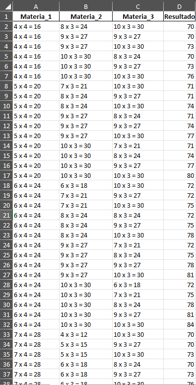

# Manejo de Excel con Python

Este proyecto genera combinaciones de calificaciones para tres materias y evalúa si cumplen con una condición de aprobación basada en una suma ponderada de sus valores. Los resultados se guardan en un archivo Excel.

## Requisitos

Para ejecutar este programa, necesitas tener instaladas las siguientes dependencias:

- Python 3.x
- Pandas (`pandas`)

Puedes instalarlas con el siguiente comando:

```bash
pip install pandas
```

## Uso

1. Abre la carpeta donde se encuentra el script en tu editor o terminal antes de ejecutarlo.
2. Ejecuta el script `Script.py` en tu terminal o entorno de desarrollo.
3. El programa generará combinaciones de notas desde 0 hasta 10 para tres materias.
4. Evaluará si la suma ponderada de las calificaciones es mayor o igual a 70.
5. Filtrará combinaciones donde cada materia tenga al menos 4 puntos.
6. Guardará los resultados en `resultados.xlsx`.
7. Mostrará un mensaje confirmando la generación del archivo.

## Explicación del Código

El script realiza los siguientes pasos:

1. **Generación de combinaciones:**
   - Itera valores de 0 a 10 para tres materias.
   - Calcula una suma ponderada: `mat1 * 4 + mat2 * 3 + mat3 * 3`.
2. **Filtrado de resultados:**
   - Se aceptan combinaciones con un puntaje final de al menos 70.
   - Cada materia debe tener un puntaje mínimo de 4.
3. **Almacenamiento:**
   - Se guardan los datos en un archivo Excel `resultados.xlsx` usando Pandas.
4. **Salida en consola:**
   - Se imprime un mensaje confirmando la creación del archivo.

## Archivos Generados

- `resultados.xlsx`: Archivo Excel con las combinaciones de notas que cumplen los criterios.

## Vista Previa del Archivo Excel

A continuación, se muestra una imagen de ejemplo de cómo luce el archivo generado:



## Mejoras Posibles

- Permitir entrada dinámica de ponderaciones y valores mínimos.
- Guardar los datos en formatos adicionales como CSV o JSON.
- Implementar una interfaz gráfica para mejorar la experiencia del usuario.

## Autor

Desarrollado por Matias De Pressa


